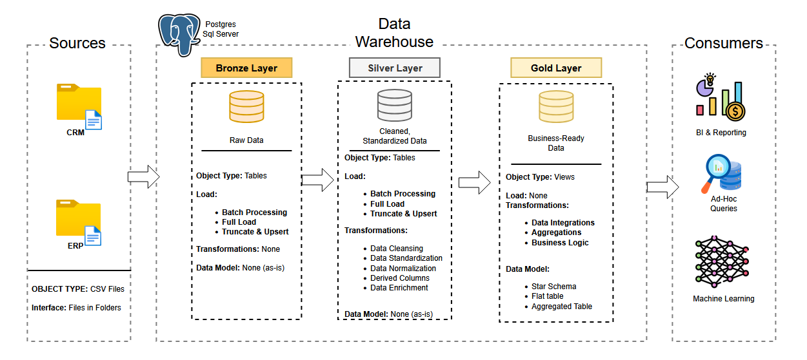

# DataWarehouse Project
Welcome to my Data Warehouse Project repository! In this project I have constructed a data warehouse with Postgres SQL, including ETL 
processes and data modeling. The Data Warehouse utilizes the medallion architecture and is ready for analysis!

## Data Architecture

I used the Medallion Architecture consisting of a **Bronze, Silver** and **Gold** layers:

1.  **Bronze Layer**: Stores raw data from the source systems. The Data is ingested from CSV files into the Postgres Database.
2.  **Silver Layer**: Cleanses, standardizes, and normalizes the data.
3.  **Gold Layer**: Data is modeled into a star schema, ready to be used for reporting and analytics. 

